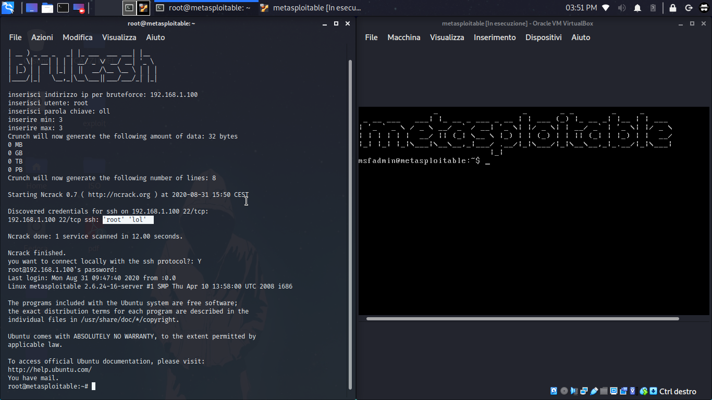
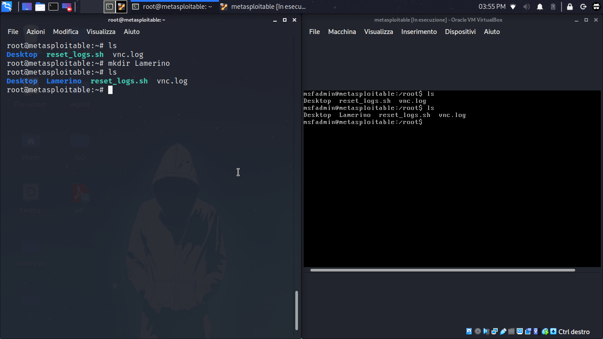

# BruteSSH

mini tool programmato in Py con licenza gplv3 **utilizzabile solo su sistemi Linux**;è in grado di compiere un **attacco bruteforce** usando il protocollo** ssh**,questo mini tool fa uso di ncrack(tool che si occupa di fare il bruteforce) e crunch(tool che si occupa di creare una lista di password)


**install Linux-based**

```bash
./install.sh
./brutessh.py
```

oppure

```bash
./install.sh
python3 brutessh.py
```

***==========================***

**photo**


<div>

</div>


<div>

</div>
